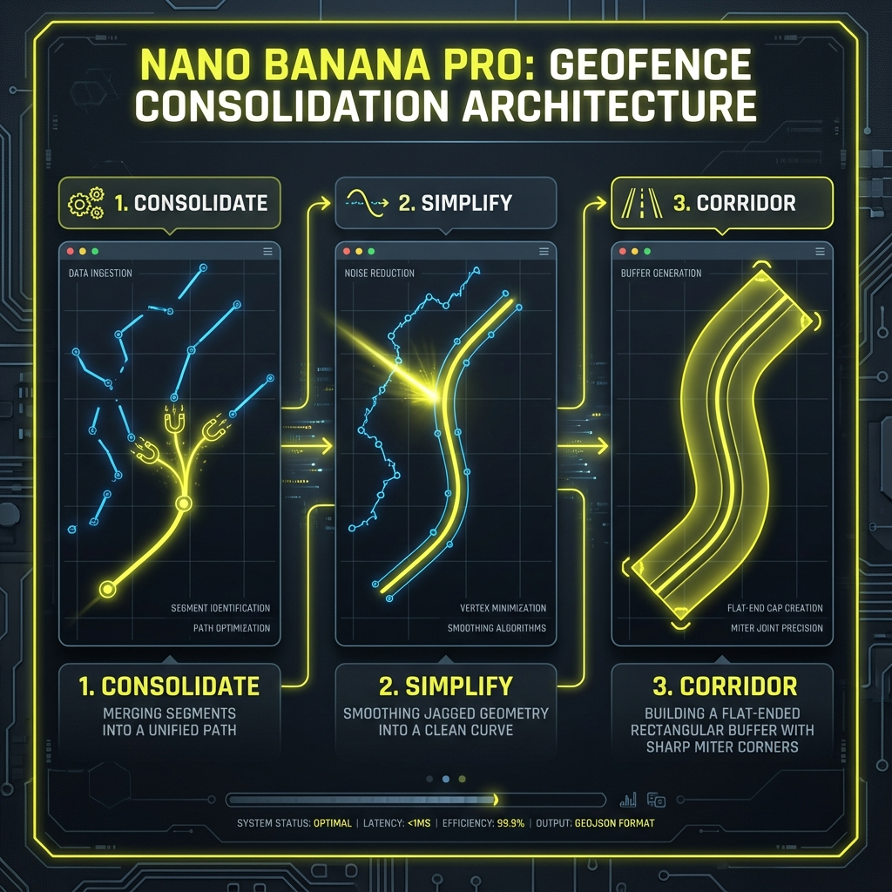
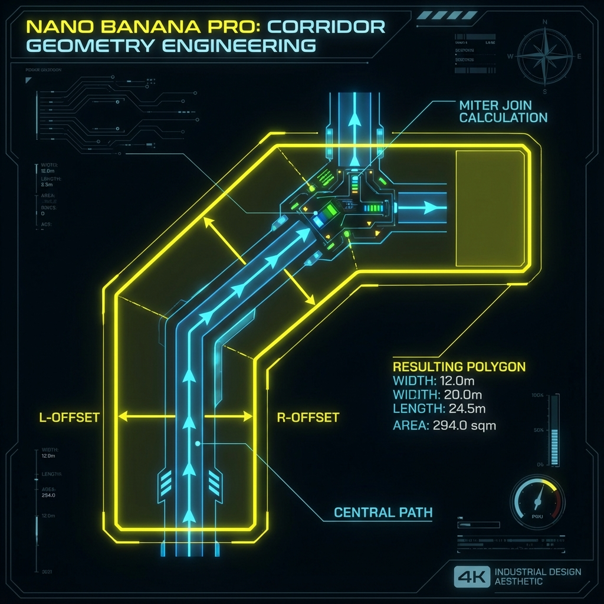

# Geofence Corridor Generation



## What is a Geofence Corridor?

A **geofence corridor** is a polygon buffer zone around a route path. It defines the acceptable area where a vehicle/object should stay while traveling along its planned route.

---

## Code Location

All geofence logic is in **`index.html`**:

| Function | Lines | Purpose |
|----------|-------|---------|
| `calculateBearing()` | 589-598 | Calculate compass bearing between two points |
| `destinationPoint()` | 601-617 | Calculate destination given start, bearing, distance |
| `createCorridorPolygon()` | 620-692 | Generate flat-ended corridor polygon |
| `generateGeofences()` | 694-813 | Main orchestrator function |
| `exportGeofences()` | 815-830 | Export to GeoJSON file |

---

## The 3-Step Algorithm

### Step 1: Consolidate Connected Segments
**Lines 712-737**

Multiple route segments that share endpoints are merged into one continuous line.

**Why?** Generating corridors for separate segments creates gaps at connection points.

```javascript
// Lines 722-729
const p1 = L.latLng(prevEnd[0], prevEnd[1]);
const p2 = L.latLng(nextStart[0], nextStart[1]);
const dist = p1.distanceTo(p2);

if (dist < 1) {
    // Connect: append next segment (skipping duplicate first point)
    currentRoute.push(...allCurvePoints[i].slice(1));
}
```

---

### Step 2: Simplify the Line
**Lines 742-749**

The consolidated line is simplified using **Turf.js** (Ramer-Douglas-Peucker algorithm).

**Why?** Raw curves have 50+ points per segment. Too many points = slow performance and bumpy edges.

```javascript
// Lines 744-749
const geoJSONPoints = routePoints.map(p => [p[1], p[0]]); // [lng, lat] for turf
const line = turf.lineString(geoJSONPoints);

// Tolerance 0.00005 deg ≈ 5 meters
const simplifiedLine = turf.simplify(line, { tolerance: 0.00005, highQuality: true });
const simplifiedLatLon = simplifiedLine.geometry.coordinates.map(c => [c[1], c[0]]);
```

---

### Step 3: Generate Flat-Ended Corridor Polygon
**Lines 620-692** (`createCorridorPolygon` function)

For each point on the simplified line:
1. Calculate the perpendicular direction (90° from travel direction)
2. Create a left offset point and a right offset point
3. At corners, use **miter join** to fill gaps

```javascript
// Lines 672-681 - Perpendicular offset calculation
const leftBearing = (offsetBearing - 90 + 360) % 360;
const rightBearing = (offsetBearing + 90) % 360;

const leftPoint = destinationPoint(lat, lng, leftBearing, offsetDistance);
const rightPoint = destinationPoint(lat, lng, rightBearing, offsetDistance);

leftSide.push(leftPoint);
rightSide.push(rightPoint);
```

**Polygon Construction** (Lines 684-689):
```javascript
const polygonCoords = [
    ...leftSide,
    ...rightSide.reverse(),
    leftSide[0] // Close the polygon
];
```

---

## Miter Join (Corner Filling)
**Lines 661-669**

At interior vertices where the route changes direction, a simple perpendicular offset leaves a gap. The miter join extends the offset to fill corners.

```javascript
// Lines 663-669
const halfAngle = Math.abs(angleDiff / 2);
const halfAngleRad = halfAngle * Math.PI / 180;

// Miter calculation: distance / cos(halfAngle)
// Limit to 3x to avoid spikes on very sharp turns
const miterLimit = 3;
const miterFactor = Math.min(1 / Math.cos(halfAngleRad), miterLimit);
offsetDistance = widthKm * miterFactor;
```

---

## Why Not Use `turf.buffer()`?

The standard Turf.js buffer function creates **rounded end caps** (circles at start/end) and **rounded corners**. 

Our custom `createCorridorPolygon()` creates:
- ✅ Flat ends (no circles)
- ✅ Miter corners (filled, not rounded)

---

## GeoJSON Export
**Lines 800-804**

```javascript
geofenceGeoJSON = {
    type: 'FeatureCollection',
    features: allCorridorFeatures
};
```

Each feature contains:
```json
{
  "type": "Feature",
  "properties": {
    "routeIndex": 1,
    "bufferDistanceKm": 0.1,
    "type": "geofence_corridor"
  },
  "geometry": {
    "type": "Polygon",
    "coordinates": [[[lng, lat], ...]]
  }
}
```

---

## Deep Dive: Corridor Geometry Creation



The core challenge of generating a clean geofence is transforming a zero-width line into a precise, flat-ended polygon. We bypass standard buffering algorithms to ensure professional, recti-linear results.

### 1. Perpendicular Vector Engineering
For every point $P_i$ on the path, we calculate the travel direction (bearing) to the next point. To build the corridor wall, we rotate this vector by $\pm 90^\circ$ to find the "Left" and "Right" offset directions.

```javascript
const leftBearing = (travelBearing - 90 + 360) % 360;
const rightBearing = (travelBearing + 90) % 360;
```

### 2. The Miter Join Resolution
When the route turns, a simple perpendicular offset at each point would create overlaps on the inside and gaps on the outside. We resolve this using **Miter Joins**. 

Instead of drawing two separate rectangles, we calculate the **Angle Bisector** (the line exactly halfway between the incoming and outgoing paths). The corridor vertex is placed along this bisector.

To maintain a consistent corridor width, the distance from the center point to the corner must be increased based on the sharpness of the turn:
$$Distance_{miter} = \frac{Distance_{base}}{\cos(\theta/2)}$$
*where $\theta$ is the angle of the turn.*

### 3. Flat End Cap Precision
Unlike `turf.buffer()` which creates circular "pill" shapes, our algorithm treats the first and last points as hard boundaries. 
- **Start Cap**: Perpendicular to the first segment.
- **End Cap**: Perpendicular to the last segment.

This ensures the geofence begins and ends exactly where the data does, with no rounded overhangs.

---

## Summary

| Step | Lines | Action | Purpose |
|------|-------|--------|---------|
| 1 | 712-737 | Consolidate | Eliminate gaps between connected segments |
| 2 | 742-749 | Simplify | Reduce points for performance |
| 3 | 620-692 | Corridor Polygon | Create flat-ended buffer with miter corners |

**Result**: Clean, continuous corridor polygons without gaps or circles.

